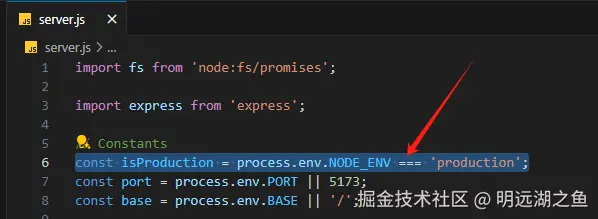

# react-ssr-demo

这是一个简易实现`React SSR`的`Demo`，配合文章[《手把手带你实现 Vite+React 的简易 SSR 改造【含部分原理讲解】》](https://juejin.cn/post/7481124518151290915)食用。

改造后的工程运行开发环境（默认）下的效果执行以下命令即可：

```bash
pnpm install
pnpm start
```

若想运行生产环境的效果，则手动将环境判断取反后再执行以下命令即可：


```bash
pnpm run build
pnpm start
```
